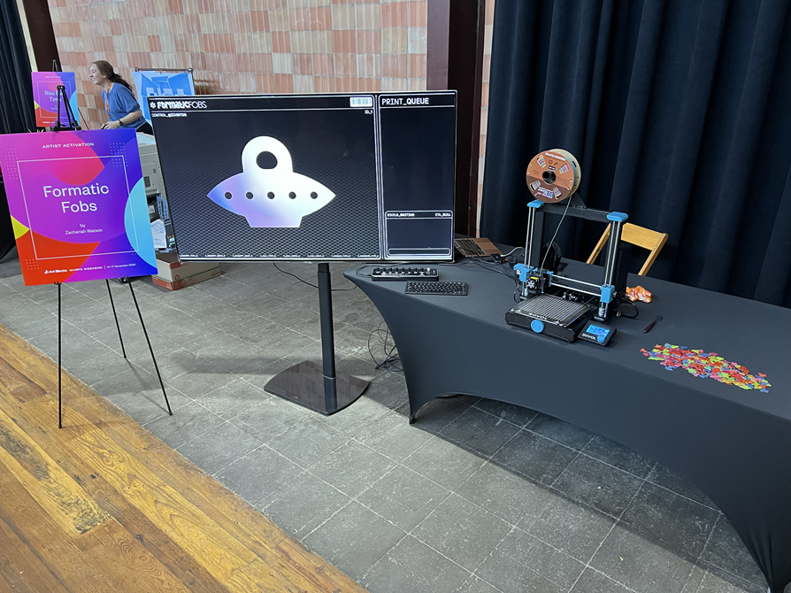
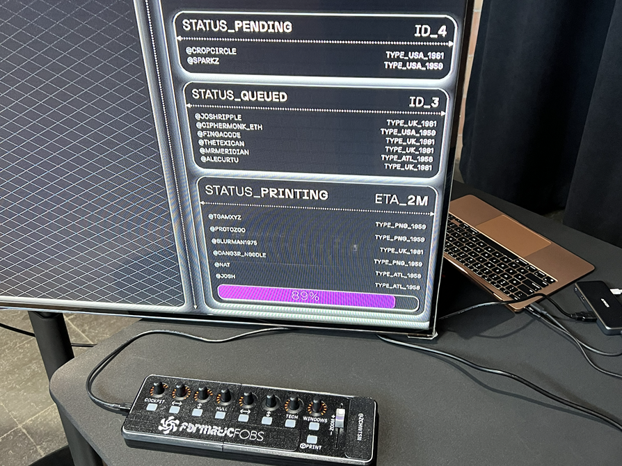
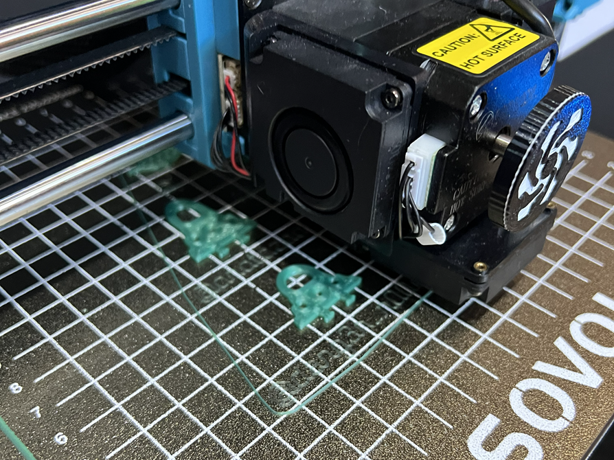

## _Promo video_


## _Exhibit at the event_



## _Queue system_



## _Printing created fobs_



## _Exhibit in action_


## .env

```
POSTGRES_USER= # postgres username
POSTGRES_PASSWORD= # postgres password
DB_HOST= # hostname (usually localhost)
POSTGRES_DB= # postgres db name
DATABASE_URL=postgresql://${POSTGRES_USER}:${POSTGRES_PASSWORD}@${DB_HOST}:5432/${POSTGRES_DB}?schema=public
OUTPUTS_PATH= # path to your 'outputs' folder (create one in root of project)
PRUSA_CLI_PATH= # path to the PrusaSlicer CLI
PRUSA_INI= # .ini file in the cfg folder
COM= # COM port of your 3D printer
NEXT_PUBLIC_PORT= # port for the Express server
```
